# Phrasal Verb Quiz
Visit the live website [here](https://hpcarey.github.io/Phrasal-verbs-quiz/)
## Purpose of the project
The purpose of this site is to provide a fun, interactive learning tool for Enlglish language learners. The phrasal verb quiz tests users knowledge of phrasal verbs related to education and learning.

The quiz is multiple choice so both advanced and lower level speakers can make us of it. Since phrasal verbs are idiomatic they can still pose a challenge to some advanced speakers of English while offering lower level learners a fun way to learn new material.

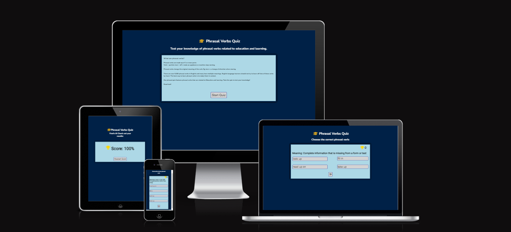
## User Stories
### Intended Users
The intended user is any person who is a learner of the English language. These can be specified as
* Beginners who are trying to build up as much vocabulary as they can during their free time or on the go.
* Learners at a pre-intermediate level who will just be being introduced to phrasal verbs and may be finding traditional learning methods overwhelming for this particular topic.
* Higher level English learners who are trying to improve their idiomatic English
* Any learer who is trying to find fun and interactive ways of studying.
* Enlgish language teachers who want non -traditional learning resources to help their students improve.

### User Stories
* As a visiting user, I want a quick and fun way to test my knowledge.
* As a visiting user, I want a short introduction of the topic so I know what is being tested.
* As a user, I want to have learned or improved my understanding in some way by the end of the quiz.
* As a user, I want the site to be reponsive and easy to use on a variety of screens so that I can use it in a variety of situations.

### Site aims
 * To provide the user with an interactive quiz to test their knowledge of certain phrasal verbs.
* To create a quiz that encourages the user to restart the quiz to improve their score or to look for more similar learning resources on the topic. 
* To provide a quiz that is fully responsive so the user can play across multiple platforms.
* To provide a simple, interactive experience that is easy to navigate and understand.
* To provide an experience that is enjoyable but still challenging and educational to the learner.

### Wireframes:
Wireframes were created using Balsamiq.
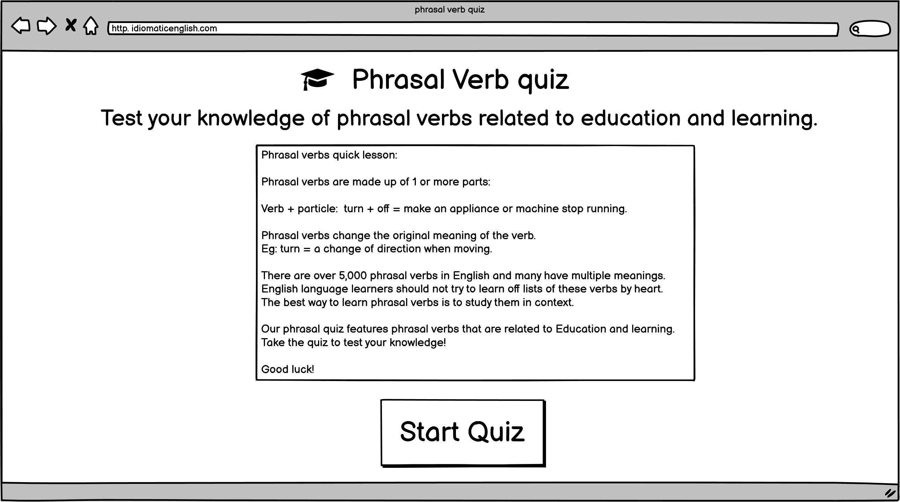
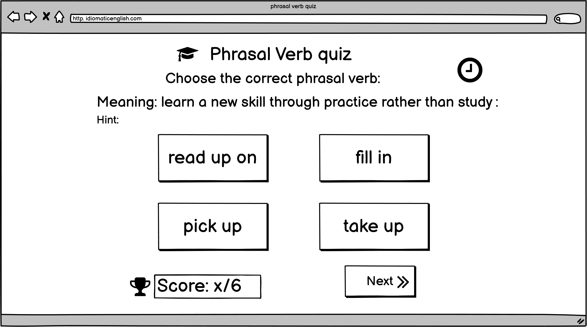
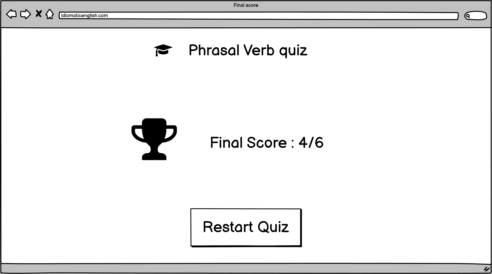
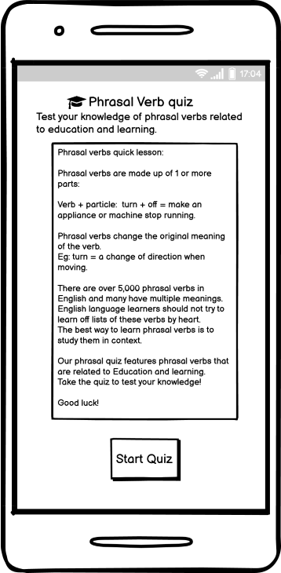
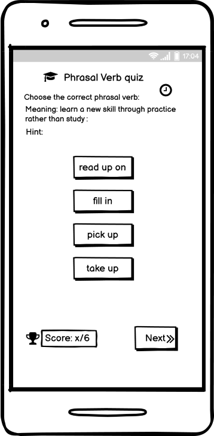
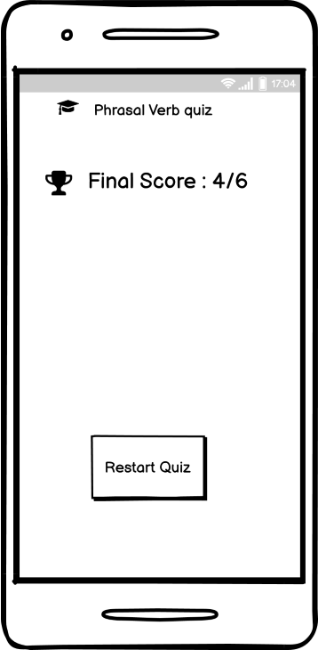

## Features
### Existing features
#### Heading and logo
Featured at the top of the page, the heading contains the name of the activity and an icon of a gradation cap take from [fontawesome.com](https://fontawesome.com/).
Each page's logo features a different sub-heading to provide the user with an explanation or context for the page that they are on. 
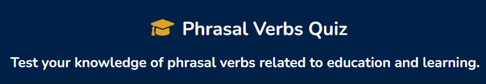

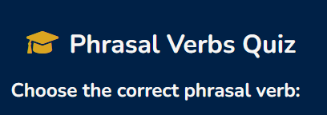

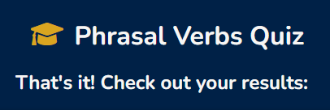

#### Landing page
* The landing page features a quick explanation about phrasal verbs and a start button.
* All buttons have a hover feature to help user's identify when the cursor is in contact with the button.

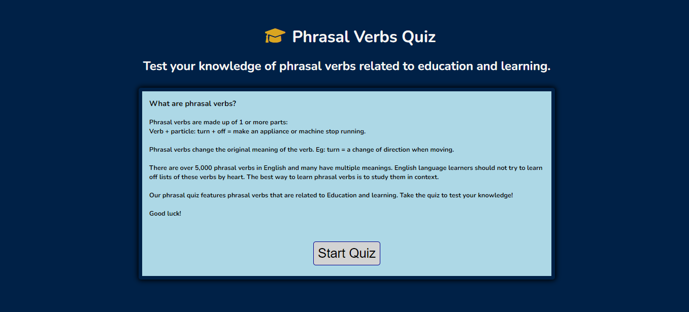

#### Quiz section
* Features a question in the form of a defintion.
* Four buttons offer the user four options to mathcwith the defintion.
* Correct answer isindicated after the click event showing a green colour.
* A trophy icon is featured next to a number in the top right corner which is incremented with every correct answer.

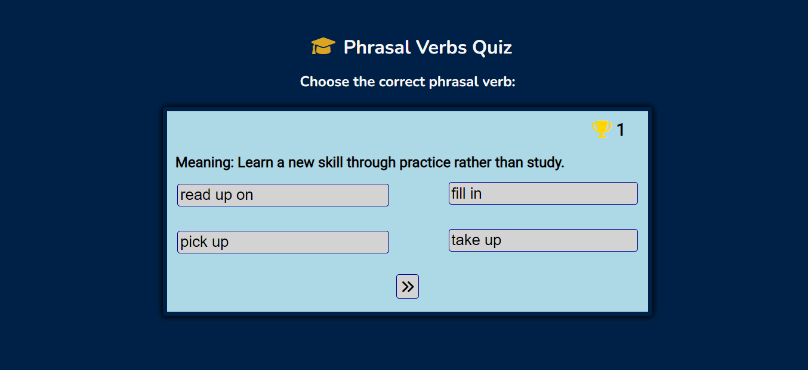

#### Results page
* This features the overall result for the user.
* There is also a restart button whic brings you back to the start page. 

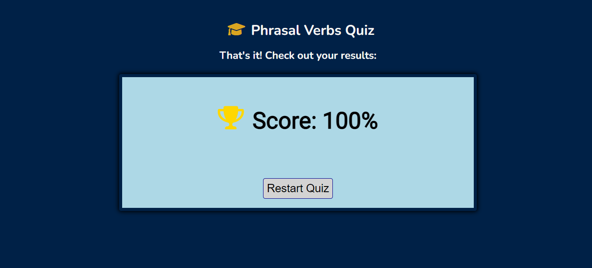

#### Favicon
* The favicon features an image of a lightbulb o signify ideas and learning and to help the tab stand out. It was generated using [favicon.io](https://favicon.io/emoji-favicons/).
## Future Features
* The idea would be that there are multiple similar quizes for learners on the site and that they would be able to login and keep track of their progress, strengths and weaknesses.
   * A login feature for returning users
   * A high score database to keep user's scores.
   * A hint function consisting of a clickable "hint" word underneath the question which reveals a sample sentence with a gap to help the user contextualise the language.
   * A timer function.
   * A counter function which counts down the number of questions.
## Typography and color scheme
* The Nunito font was chosen using google fonts because it is simple and readable but also has a softness because of the rounded edges.
* I used [figma](https://www.figma.com/file/RgYErSjELw326fP4MH6jt4kT/Nunito-Pairings/duplicate?node-id=1%3A198) to check what fonts pair well with Nunita and ended up going with Roboto.
* I wanted a blue theme to represent education, so I used a darker blue for the background,  a light blue for the quiz container, and chose dark and light coloured fonts to pair with them for readability. 
* The icons used are colored in gold and are symbols of success and learning, the graduation cap and trophy. 

===== Before Code/implementation ===
## Technology
### Languages 
* HTML
* CSS
* Javascript
### Frameworks and Libraries
* [Font awesome](https://fontawesome.com/)
* [Pairfonts](https://pairfonts.com/)
* [Google fonts](https://fonts.google.com/)
* [Balsamiq](https://balsamiq.com/wireframes/)
* [Github](https://github.com/)
* [Gitpod](https://gitpod.io/)
* [Tiny PNG](https://tinypng.com/)
* [Pixabay](https://pixabay.com)
* [Unsplash](https://unsplash.com)
* [Pexels](https://www.pexels.com)
* [Eightshapes](https://contrast-grid.eightshapes.com/)
* [Colour Palette](docs/README-images/colour-palette.png)
* [rgbacolorpicker](https://rgbacolorpicker.com/hex-to-rgba)
* [Am I responsive](https://ui.dev/amiresponsive)
## Testing
### User Stories
* As a user, I want contextual examples of how to use the target language.
* As a user, I want the site to be reponsive and easy to use on a variety of screens so that I can use it in a variety of situations.

1. As a visiting user, I want a quick and fun way to test my knowledge.
    * The quiz is simple and quick and gives langauge learners an interactive way to learn. 
2.  As a visiting user, I want a short introduction of the topic so I know what is being tested.
    * Users are given an explanation on the landing page of the grammar being tested.
    * Users are also given instructions in the form of a heading underneath the logo that conextualises and explains what each page is for and how they should interact with the site.
3.  As a user, I want to have learned or improved my understanding in some way by the end of the quiz.
    * The correct answers are indicated by a green background color once the user has clicked their answer.
    * The user is given defintions for each phrasal verb and has the chance to restart and do the quiz again to re-test themselves if they want to improve. 
4. As a user, I want the site to be reponsive and easy to use on a variety of screens so that I can use it in a variety of situations.
    * The site is fully responsive and can be played on the go using a mobile or tablet screen.
    * The site is easy to navigate through clearly labelled buttons that are intuitive and have a hover effect. 

### Manual Testing
1. Buttons - check on all screen sizes, for all pages and sections.
    * Check all buttons are acitve and do what they should. 
    * Check that the restart button resets the score and the welcome heading.
    * Check that the next button is disabled until an answer is clicked by the user.
    * Check that the answer buttons are disable once an answer is selected.
2. Responsive
    * Using chrome develper tools, verify that
    the site is fully responsive with no overflow and no scroll. 
    * Ensure answer buttons display 1 fr grid in mobile screens.
3. Score
    * Check that the score only increments for correct answers
    * Check that the score resets once the quiz is restarted.
    * Check that the result displayed is accurate.

### Code Validation
1. HTML
    * HTML validationwas done using [W3C Markup validator](https://validator.w3.org/)
    * Some initial errors for the quiz section and the results page included:
        * a "section lacks heading" warning: 
            * This error is as a result of having a section for each of the pages of the site whoch are initially hidden with a hide class and implemented after a click event. I included a heading for these sections for good semantic practice, but put it in the hide class as it was not necesarry for the UI.
        * Another error showed an unclosed div which was causing display problems in the deployed site but not in the gitpod browser. Once fixed all display issues were solved.

        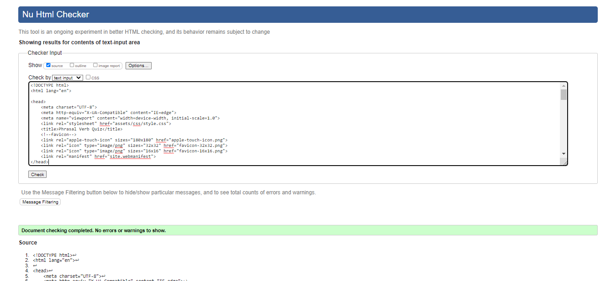
            
 
2. CSS
    * CSS Validation was done using [Jigsaw](https://jigsaw.w3.org/css-validator/)

    * [CSS validator results](http://jigsaw.w3.org/css-validator/validator$link)

    * No bugs were found in the CSS at the final tetsing stage as I had been testing throughout development and CSS bugs were common and obvious in the gitpod browser so were quickly identified and fixed.

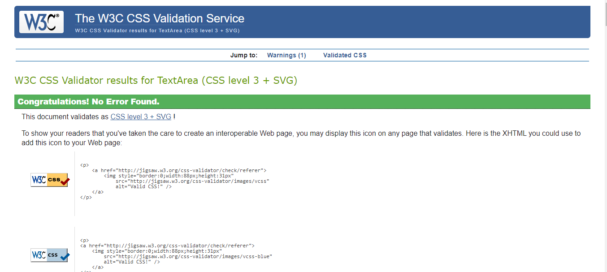

3. Lighthouse
 * Initial results showed a good accessibility score and good overall scores except for SEO which was 89%.
    * I addressed this issue by adding some meta tags to the head of the html document containing a description of the site and some keywords.
* The ligthouse results for mobile showed the same overall results with a slightly better SEO score of 91%.

#### Lighthouse results

#### Lighthouse mobile results

4. 
* Javascript validation was done using [JSHint Validator](https://jshint.com/).

### Fixed bugs
I have detailed some of the sources I used to fix bugs in the Credit section. Some of the main issues that were resolved were:
* Answers were not displaying in the answer button and the error in the console was: cannot set property innerhtml of null. So I ran console.log on the first button and it was undefined. I did some google searching to see why that might be because my id was definitely correct This [website](https://bobbyhadz.com/blog/javascript-cannot-set-property-innerhtml-of-null#:~:text=To%20resolve%20the%20%22Cannot%20set,not%20present%20in%20the%20DOM.) provided some explanations and through process of elimination I decided to remove the div container id and that solved the issue. 
* Correct/Incorrect class was not being removed fromanswer buttons once new question was rendered. I ran console.log on the answer buttons and saw that I was targeting them using their individual ids so I could see from the console that it was better to target them by class.
* Pusing content to the bottom of a flex item.
* Ensuring flex items wrap under 1030 px depsite display: flex, flex: 1; being applied to make flex items equal width. 
* A horizontal scroll bar which was the result of using a fixed width on elements instead of using ems or %.
* A footer bug on the community page occured for a while. I could not fix it by targeting the footer alone, so I commented it out and worked on the other features on the page, making them responsive and adjusting them to fit the page better. When I commented the footer back in it stayed at the bottom of the page where it should be. 

### Unfixed bugs
* The font size of links changes because of pseudo hover class in order to make links more visible to the user, however the size change affects the other content and causes things to jump around. 
* The navbar loses it's structure below 280 px. This is really narrow so it doesn't require urgent attention but would be worth looking into howto maintain navbar structure asa much as possible. 
* Since changing the video width and height properties by moving them from the embedded link to css, the thumbnail image for the video is slightly cut off on smaller screens. The video itself is fine, but I wouls like to fix this thumbnail issue.

### Screens and Browsers
* The site was tested in chrome, firefox and microsoft edge browsers
   8.1 code validation
   8.2 test cases (user story based with screenshots)
   8.3 fixed bugs
   8.4 supported screens and browsers
## Deployment
This website was deployed via Github pages via the folowing steps:
1. Navigate to the Settings tab in the GitHub repository for the project.
2. Find the pages tab from the left-hand menu and select.
3. Under the Source tab, select the branch called Main the folder called Root.
4. Click save and the page displays the deployement link.
5. It can take up to 5 minutes to deploy.
Here is a link to the live [site]().
## Credits
I used the following resources to help me plan, builda and fix bugs in my project.

* This video by the Code Explained channel helped me to think about how to apporach and plan the project. It was really useful for helping to visualise the whole picture as they did a whole planning phase in the video before writing any code. [Create a Multiple Choice Quiz App Using JavaScript](https://www.youtube.com/watch?v=49pYIMygIcU&ab_channel=KevinPowell)

* This video by Web Dev Simplified was the main inspiration behind my quiz design. I followed along with his video for many of the features which can also be seen in the JSDoc in the script. I also was inspired by some of the css in this video, for example the box-shadow effect and I liked the display and aesthrtic of this quiz as I also wanted to go with a blue colour scheme. [Build A Quiz App With JavaScript](https://www.youtube.com/watch?v=riDzcEQbX6k&ab_channel=WebDevSimplified)

* This article [Set the disabled attribute using javascript](https://bobbyhadz.com/blog/javascript-set-attribute-disabled#:~:text=To%20set%20the%20disabled%20attribute,disabled%20attribute%20to%20the%20element.) helped me to disable buttons that were not needed on the screen. 