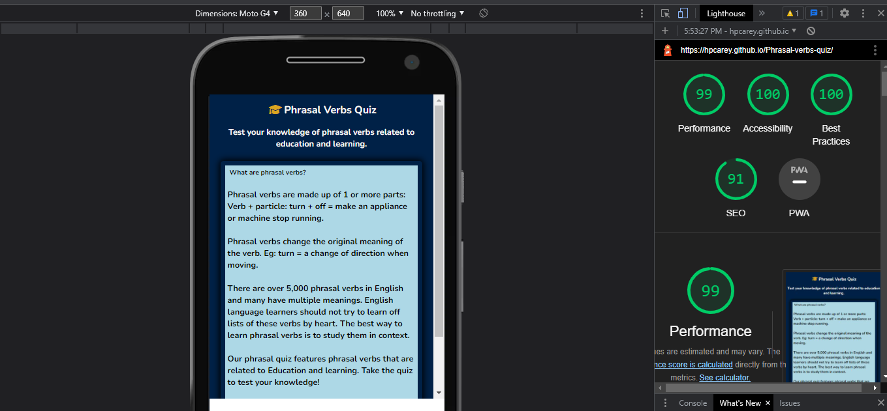
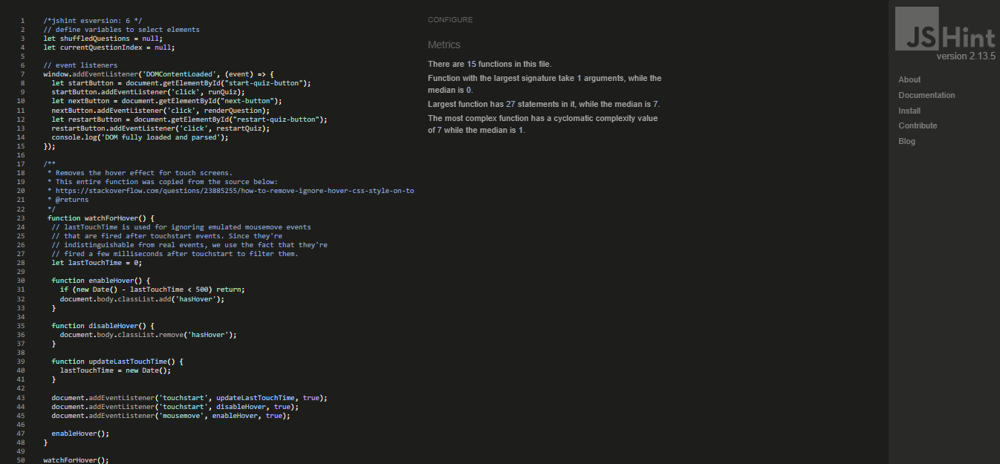

# Phrasal Verb Quiz
Visit the live website [here](https://hpcarey.github.io/Phrasal-verbs-quiz/)
## Purpose of the project
The purpose of this site is to provide a fun, interactive learning tool for Enlglish language learners. The phrasal verb quiz tests user's knowledge of phrasal verbs related to education and learning.

The quiz is multiple choice so both advanced and lower level speakers can make us of it. Since phrasal verbs are idiomatic they can still pose a challenge to some advanced speakers of English while offering lower level learners a fun way to learn new material.

## User Stories
### Intended Users
The intended user is any person who is a learner of the English language. These can be specified as
* Beginners who are trying to build up as much vocabulary as they can during their free time or on the go.
* Learners at a pre-intermediate level who will just be being introduced to phrasal verbs and may be finding traditional learning methods overwhelming for this particular topic.
* Higher level English learners who are trying to improve their idiomatic English
* Any learner who is trying to find fun and interactive ways of studying.
* Enlgish language teachers who want non-traditional learning resources to help their students improve.

### User Stories
* As a visiting user, I want a quick and fun way to test my knowledge.
* As a visiting user, I want a short introduction of the topic so I know what is being tested.
* As a user, I want to have learned or improved my understanding in some way by the end of the quiz.
* As a user, I want the site to be reponsive and easy to use on a variety of screens so that I can use it in a variety of situations.

### Site aims
 * To provide the user with an interactive quiz to test their knowledge of certain phrasal verbs.
* To create a quiz that encourages the user to restart the quiz to improve their score or to look for more similar learning resources on the topic. 
* To provide a quiz that is fully responsive so the user can play across multiple platforms.
* To provide a simple, interactive experience that is easy to navigate and understand.
* To provide an experience that is enjoyable but still challenging and educational to the learner.

### Wireframes:
Wireframes were created using Balsamiq.

## Features
### Existing features
#### Heading and logo
Featured at the top of the page, the heading contains the name of the activity and an icon of a gradation cap taken from [fontawesome.com](https://fontawesome.com/).
Each page's logo features a different sub-heading to provide the user with an explanation or context for the page that they are on. 

#### Landing page
* The landing page features a quick explanation about phrasal verbs and a start button.
* All buttons have a hover feature to help users identify when the cursor is in contact with the button.

#### Quiz section
* Features a question in the form of a defintion.
* Four buttons offer the user four options to match with the defintion.
* A correct answer is indicated after the click event showing a green colour.
* An incorrect answer is indicated after the click event showing a red colour.
* A trophy icon is featured next to a number in the top right corner which is incremented with every correct answer. 
* note: The position of the score was changed from the original design in the wireframes after consulting with my mentor who advised it would be better UX to have the score higher on the screen, so it is now at the top right corner of the div containing the quiz.

#### Results page
* This features the overall result for the user.
* There is also a restart button which brings you back to the start page. 

#### Favicon
* The favicon features an image of a lightbulb to signify ideas and learning and to help the tab stand out. It was generated using [favicon.io](https://favicon.io/emoji-favicons/).
## Future Features
* The idea would be that there are multiple similar quizes for learners on the site and that they would be able to login and keep track of their progress, strengths and weaknesses. So future features would include:
   * A login feature for returning users
   * A high score database to keep user's scores.
   * A hint function consisting of a clickable "hint" word underneath the question which reveals a sample sentence with a gap to help the user contextualise the language.
   * A timer function.
   * A counter function which counts down the number of questions.
## Typography and color scheme
* The Nunito font was chosen using google fonts because it is simple and readable but also has a softness because of the rounded edges.
* I used [figma](https://www.figma.com/file/RgYErSjELw326fP4MH6jt4kT/Nunito-Pairings/duplicate?node-id=1%3A198) to check what fonts pair well with Nunita and ended up going with Roboto.
* I wanted a blue theme to represent education, so I used a darker blue for the background,  a light blue for the quiz container, and chose dark and light coloured fonts to pair with them for readability. 
* The icons used are colored in gold and are symbols of success and learning, the graduation cap and trophy. 
## Technology
### Languages 
* HTML
* CSS
* Javascript
### Frameworks and Libraries
* [Font awesome](https://fontawesome.com/)
* [Pairfonts](https://pairfonts.com/)
* [Google fonts](https://fonts.google.com/)
* [Balsamiq](https://balsamiq.com/wireframes/)
* [Github](https://github.com/)
* [Gitpod](https://gitpod.io/)
* [favicon.io](https://favicon.io/emoji-favicons/)
* [figma](https://www.figma.com/file/RgYErSjELw326fP4MH6jt4kT/Nunito-Pairings/duplicate?node-id=1%3A198)
* [Am I responsive](https://ui.dev/amiresponsive)
## Testing
### User Stories
1. As a visiting user, I want a quick and fun way to test my knowledge.
    * The quiz is simple and quick and gives langauge learners an interactive way to learn. 
2.  As a visiting user, I want a short introduction of the topic so I know what is being tested.
    * Users are given an explanation on the landing page of the grammar being tested.
    * Users are also given instructions in the form of a heading underneath the logo that conextualises and explains what each page is for and how they should interact with the site.
3.  As a user, I want to have learned or improved my understanding in some way by the end of the quiz.
    * The correct answers are indicated by a green background color once the user has clicked their answer.
    * The user is given defintions for each phrasal verb and has the chance to restart and do the quiz again to re-test themselves if they want to improve. 
4. As a user, I want the site to be reponsive and easy to use on a variety of screens so that I can use it in a variety of situations.
    * The site is fully responsive and can be played on the go using a mobile or tablet screen.
    * The site is easy to navigate through clearly labelled buttons that are intuitive and have a hover effect. 

### Manual Testing
1. Buttons - check on all screen sizes, for all pages and sections.
    * Check all buttons are acitve and do what they should. 
    * Check that the restart button resets the score and the welcome heading.
    * Check that the next button is disabled until an answer is clicked by the user.
    * Check that the answer buttons are disabled once an answer is selected.
2. Responsive
    * Using chrome develper tools, verify that
    the site is fully responsive with no overflow and no scroll. 
    * Ensure answer buttons display 1 fr grid in mobile screens.
3. Score
    * Check that the score only increments for correct answers.
    * Check that the score resets once the quiz is restarted.
    * Check that the result displayed is accurate.

### Code Validation
1. HTML
* HTML validation was done using [W3C Markup validator](https://validator.w3.org/)
 * Some initial errors for the quiz section and the results page included:
     * A "section lacks heading" warning: 
        * This error is as a result of having a section for each of the pages of the site which are initially hidden with a hide class and implemented after a click event. To address this, I included a heading for these sections for good semantic practice, but put it in the hide class as it was not necesarry for the UI.
    * Another error showed an unclosed div which was causing display problems in the deployed site but not in the gitpod browser. Once fixed all display issues were resolved.

            
 
2. CSS
    * CSS Validation was done using [Jigsaw](https://jigsaw.w3.org/css-validator/)

    * No bugs were found in the CSS at the final tetsing stage as I had been testing throughout development and CSS bugs were common and obvious in the gitpod browser so were quickly identified and fixed.

3. Lighthouse
 * Initial results showed a good accessibility score and good overall scores except for SEO which was 89%.
    * I addressed this issue by adding some meta tags to the head of the html document containing a description of the site and some keywords.
* The ligthouse results for mobile showed the same overall results with a slightly better SEO score of 91%.
* The final lighthouse results showed an improved score of 100% in SEO thanks to the inclusion of meta tags.
#### Lighthouse results

#### Lighthouse mobile results

#### Lighthouse final results

#### Lighthouse mobile final results

4. Javascript
* Javascript validation was done using [JSHint Validator](https://jshint.com/).
* Upon testing there were not that many errors as I had been using JSHint throughout to check for and fix bugs. The initial results showed one warning and one error as follows:
    * Warning: A leading decimal point can be confused with a dot: '.5'. This had not been affecting my output in any way so I didn't address it until the end. A quick google search showed that putting a 0 in front of the . will solve this issue.
    * One unused variable: selectedButton. I saw that I redeclared selectedButton inside whatever function it was in so there was no need to declare it at the top with a null value.
* Some common errors that came up throughout the project in JSHint were unused variables, missing semi-colons and unclosed functions.
* I also used console log and the error messages that would display in the console in chrome devtools to resolve bugs along the way.   
#### JSHint initial results

#### JSHint final results

### Fixed bugs
I have detailed some of the sources I used to fix bugs in the Credit section. Some of the main issues that were resolved were:
1. Answers were not displaying in the answer button and the error in the console was showing in the displayQuestion function: cannot set property innerhtml of null. 
    * I ran console.log on the first button and it was undefined. I did some google searching to see why that might be because my id was definitely correct.
    * This [website](https://bobbyhadz.com/blog/javascript-cannot-set-property-innerhtml-of-null#:~:text=To%20resolve%20the%20%22Cannot%20set,not%20present%20in%20the%20DOM.) provided some explanations and through process of elimination I decided to remove the div container id and that solved the issue. 

2. The biggest bug that took quite a bit of time to work out was that the wrong answers were being displayed as correct answers. In the console it sometimes showed that the correct answer for a question wasn't even in the options. 
    * I couldn't understand for a long time what was going on and was focusing all my attention on the checkAnswer function. It was only after going to tutor support that the tutor Alex was able to identitify that the issue was the currentQuestionIndex++ in the renderQuestion function. 
    * Once I removed this it solved the problem of the correct answer being identified but then the next question wasn't being rendered.
    * I added currentQuestionIndex++ to the next button event listener in the checkAnswer function and that resolved the question render bug. 

3. Correct/Incorrect class was not being removed from answer buttons once new question was rendered. 
    * I ran console.log on the answer buttons and saw that I was targeting them using their individual ids, so I could see from the console that it was better to target them by class.

4. The score and result from previous games would be continued in the next game if the user clicked restart.
    * To fix the score I just had to edit the innerHTML of the score element. 
    * The code to calculate the result was a bit more complicated and involved inserting a paragraph element. I had to figure out how to target that specific paragraph element and remove it once the restart function was called. Details of this are in the credit section.

5. The final question would jump straight to the end quiz page once the user clicked the answer, but ideally that wouldn't happen. I wrote the code so that the next-button event listener should call the end quiz function, giving the user a chance to see whether their final answer is correct or not. At some point I had it working like this, but along the way after making adjustjments for other features to work properly, this bug reappeared. 
    * Eventually I realised that this bug was due to the fact that I had included the endquiz funciton brackets () inside the event listener.
    * Once I removed the brackets another bug presented in which the quiz would only iterate one question before going to the end quiz page and show the user the results after the user had clicked restart
    * I thought this bug could be fixed if I declared currentQuestionIndex = 0 but that was not effective.
    *After trying a number of things, I went on to tutor support and the tutor Kevin realised the issue was with the event listener calling the endQuiz function and that I needed to remove this event listener in the restartQuiz function. He sent me a link about how to do this and this resolved the problem.  

### Unfixed bugs
*  I wanted to find a way to remove the hover.pseudo class once a button had been clicked but the only solutions I found meant I would have to edit a lot of code in the html and css and I wanted to focus on Javascript for this project.

### Screens and Browsers
* The site was tested in chrome, firefox and microsoft edge browsers. 

## Deployment
This website was deployed via Github pages via the folowing steps:
1. Navigate to the Settings tab in the GitHub repository for the project.
2. Find the pages tab from the left-hand menu and select.
3. Under the Source tab, select the branch called Main the folder called Root.
4. Click save and the page displays the deployement link.
5. It can take up to 5 minutes to deploy.
Here is a link to the live [site](https://hpcarey.github.io/Phrasal-verbs-quiz/).
## Credits
I used the following resources to help me plan, build and fix bugs in my project.

* This video: [Create a Multiple Choice Quiz App Using JavaScript](https://www.youtube.com/watch?v=49pYIMygIcU&ab_channel=KevinPowell)
by the Code Explained channel helped me to think about how to apporach and plan the project. It was really useful for helping to visualise the whole picture as they did a whole planning phase in the video before writing any code. It also showed me the basis of the code I would need to calculate and display a percentage result of the user's score at the end of the quiz.

* This video: [Build A Quiz App With JavaScript](https://www.youtube.com/watch?v=riDzcEQbX6k&ab_channel=WebDevSimplified) by Web Dev Simplified was the main inspiration behind my quiz design. I followed along with his video for many of the features which can also be seen in the JSDoc in the script. I also was inspired by some of the css in this video, for example the box-shadow effect and I liked the display and aesthetic of this quiz as I also wanted to go with a blue colour scheme. 

* This article [Set the disabled attribute using javascript](https://bobbyhadz.com/blog/javascript-set-attribute-disabled#:~:text=To%20set%20the%20disabled%20attribute,disabled%20attribute%20to%20the%20element.) helped me to disable buttons that were not needed until certain events and then remove the disable attribute after said events. 

* This [article](https://www.koderhq.com/tutorial/javascript/event-listener/#:~:text=We%20can%20invoke%20multiple%20functions,once%20with%20a%20different%20function.&text=In%20the%20example%20above%2C%20we%20add%20another%20event%20listener%20for,event%20on%20the%20same%20button.) from koderhq.com helped me to make the most out of event listeners in my code. 
* I copied and pasted code content directly from [this](https://stackoverflow.com/questions/23885255/how-to-remove-ignore-hover-css-style-on-touch-devices) Stackoverflow thread to resolve a hover bug in mobile screens which was preventing the correct and incorrect class from providing the user with visual feedback.

* Some articles from [w3schools](https://www.w3schools.com/) that helped me with some key features:
    
    * This [article](https://www.w3schools.com/js/js_htmldom_html.asp)  on changing the innerHTML of an element. I used this throughout my code.
    * This [article](https://www.w3schools.com/jsref/met_element_remove.asp) on removing an element and [this](https://www.w3schools.com/jsref/prop_node_lastchild.asp) one on targeting the last child helped me to write the code to reset the calculated result at the end of the quiz.
     
* I'd also like to mention that I received invaluable advice and help from members on the CI slack community, from tutors and from my mentor.